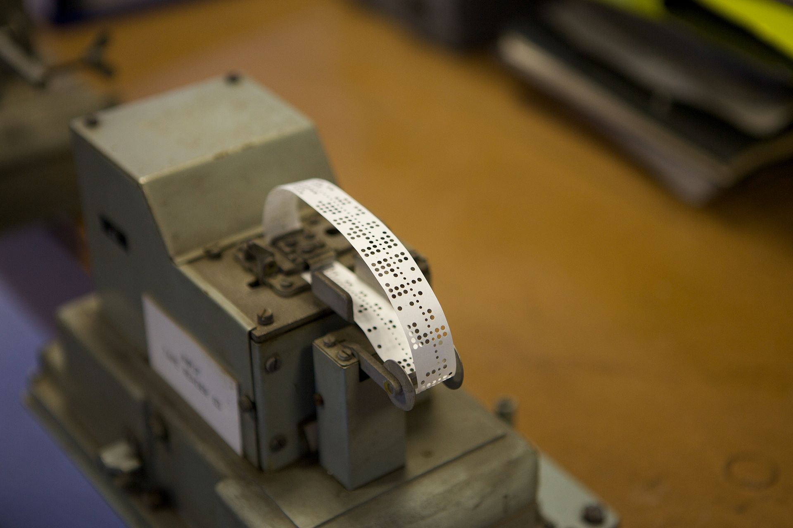

# CSCI 1102 Computer Science 2

### Fall 2018

------

## Lecture Notes

### Week 2

#### Topics:

1. ADTs in Java
2. Symbols, Digital Representation and Memory/Storage Architecture
3. Understanding the Java attribute **static** & the special variable **this**

---

**Notes:**

  1. If you are still having problems with your system configuration, please see me.
---

## 1. ADTs in Java

#### Review

The main items from last week, were:

  1. When implementing data structures and their associated algorithms we're going to use Liskov's Abstract Data Type (ADT) methodology. ADTs have:

    + specifications  (provided to the users/clients)

    + implementations (the details of which are hidden from the users/clients)


  2. Java supports ADTs, albeit imperfectly. We'll use Java

    + **interfaces** for ADT specifications (although they don't do everything that ADTs actually require)

    + **classes** for ADT implementations (although they don't do everything that ADTs require either!)

  3. Java classes have essentially two roles:

        + as implementations of ADTs;

        + to otherwise aggregate related definitions, e.g., all of the math functions can be bundled up in a Math class.

#### Types in Java

Java has three kinds of types:

  1. **base types** — `byte`, `short`, `int`, `long`, `float`,  `double`, `void`, `boolean`, `char`, all lowercase;
  2. **reference types** — the value of an expression `new ClassName(...)` is allocated in the heap and then *referenced* by its address (or pointer, drawn as an arrow), see below.
  3. **interfaces** --- specifications.

We will usually use interfaces for types rather than class names. For example, given:

```java
public interface Point { ... }
public class PointC implements Point { ... }
```

We would declare a variable of type `Point` and create its value as in

```java
Point p = new PointC(0, 0);
```

NB: we're using the interface name as the type will referring to the class name in the `new` expression on the right.

---

## 2. Symbols, Digital Representation and Memory/Storage Architecture

## Symbols and Digital Representations

Your friend Martha isn't actually in your contacts list, she actually lives in the physical world, she's merely *represented* in your list by a symbolic proxy, hopefully a unique symbolic proxy, otherwise you might confuse her with your friend Mei. A touchstone of digital computers is their use of *sequences* *of symbols* as a universal proxy or representation language. 

Let's say we have a *set* $A$ with $n$ unique symbols $A = \{a_1, …, a_n\}$ and let's consider *sequences* of symbols drawn from $A$. These are sometimes called *words* over $A$. Let $\epsilon$ denote the empty sequence. Then the set of sequences over $A$ is
$$
A^* = \{ w \mid w = \epsilon\ \mathrm{or}\ w = aw'\ \mathrm{where}\ a\in A\ \mathrm{and}\ w'\in A^*\}
$$

For example, let $B = \{ 3, 4 \}$. Then all of $\epsilon$, $3\epsilon$ and $434344\epsilon$ are in $B^*$. We'll usually omit the trailing $\epsilon$. 

For $w \in A^*$, let $\mid w \mid$ denote the length of, i.e., the number of non-$\epsilon$ symbols in $w$. We can gather sequences of length $k$ in a set:
$$
A^k = \{ w \mid w\in A^*\ \mathrm{and}\ \mbox{$\mid w\mid$} = k \}
$$
How large is $A^k$? Let's use $\mid A \mid$ for the size of $A$. If $\mbox{$\mid A \mid$} = n$, then $\mbox{$\mid A^k\mid$} = n^k$. For example, consider $n=3$ with $B = \{ a, b, c \}$. There are $3^1 = 3$ $B$-sequences of length $k =1$: $a$, $b$ and $c$ and there are $3^2 = 9$ $B$-sequences of length $k = 2$: $aa$, $ab$, $ac$, $ba$, $bb$, $bc$, $ca$, $cb$ and $cc$. If we had 6 contacts, sequences of elements of $\{a, b, c\}$ of length $k = 2$ would suffice because we'd have a unique pattern to represent each contact with 3 left over. 

Electronic digital computers use a fixed number of discrete electronic voltages to represent the unique symbols in $A$. In theory one could choose any number of such voltages, e.g., $n = 3$ — we might call this a *ternary* *digital* *computer*. But it turns out to be best to choose $n = 2$ or *binary* because, as far as the engineering goes, it's easier and more cost-effective to distinguish only between a high voltage and a low voltage, than it is to distinguish between say 3 voltage levels. 

The two basic voltage states in a binary digital computer can be characterized in many ways: *on* or *off*, *up* or *down*, *true* or *false*, *yin* or *yang*, *black* or *white* but most commonly — because of our natural interest in numbers — they are thought of as *binary* *digits*, or *bits*: 1 or 0. Hence the phrase: *digital* computer. From here on, we'll use the standard terminology using both "digital computer" or just "computer" to refer to a binary digital computer.

We'll often be working with sequences of bits. How long are the bit sequences? Well, it depends on what sort of thing we need to represent. For example, if we're interested in representing the four nucleotides *adenine*, *cytosine*, *guanine* and *thymine*, we could choose $n = 2$ because $2^2 = 4$ and we'd have exactly one 2-bit pattern for each nucleotide. We might choose, say

| adenine | cytosine | guanine | thymine |
| :-----: | :------: | :-----: | :-----: |
|   00    |    01    |   10    |   11    |

If we wanted to represent the 26 uppercase letters in the Roman alphabet, **A** through **Z**, we'd need bit sequences of length $k = 5$ because $2^5 = 32$. This enables us to choose a unique sequence for each letter (with 6 left over). Choosing $k = 4$ wouldn't do because $2^4 = 16$ — too few patterns to have unique representations. As far as the particular choices go, it might be natural to choose

|   A   |   B   | ...  |   Z   |
| :---: | :---: | :--: | :---: |
| 00000 | 00001 | ...  | 11010 |

> It's worth noting here that for the purposes of representing the items in question, nucleotides or letters, we're viewing the bit sequences here simply as unique *patterns* — in particular, we're not interpreting the sequences as numerals.

**Protocols**

These are both reasonable representation systems because they provide unique patterns to the items being represented. However, any representation system is useless if it isn't recognized and adopted by all parties working with the represented items. If one computer is running a bioinformatics application and sharing data with applications on another computer, a *protocol* or *convention* must be established between the two applications that ensures that the 2-bit pattern 10 means guanine and not adenine.

#### Bytes — ASCII and the Representation of Alphabetic Symbols

A quick glance at your computer's keyboard will show something like 5 or 6 rows of keys, each with something like 13 or 14 keys across. Some are labeled with letters, some with digits, some with punctuation symbols, some are control keys. A back of the envelop calculation gives $5 \times 13 = 65$ and the various control keys such as shift, we wind up having somewhere north of 130 different characters that we might type on a standard Roman alphabet keyboard. What length bit string would be needed to provide a unique representation for each key? We choose bit sequences of length $k = 8$ because $2^8 = 512$ provides enough unique patterns. 

A US and Latin-alphabet based protocol for character codes (the [American Standard Code for Information Interchange](https://en.wikipedia.org/wiki/ASCII), aka ASCII) was established in the early 1960s. If you google it, you'll find that the ASCII standard code assigns the 8-bit sequence 01000001 as the representation of the letter **A**, it assigns the 8-bit sequence 01000010 for **B** and so forth. The ASCII code assigns the 8-bit sequence 00110000 as the representation of the digit **0**. The ASCII table is shown below in the section on Numeral Systems.

ASCII has been superceded with a newer international code called [Unicode](http://www.unicode.org/). Unicode establishes a 16-bit code which has enough bit patterns ($2^{16} = 65536$) to account for all of the non-Roman alphabets throughout the world.

The discussion above explains why the bit and the byte are the basic units of storage on digital computers. But most computations are concerned with numbers of various kinds: natural numbers, integers or real numbers. How are they represented? And how are we to represent more numbers that the very limited $2^8 = 256$ patterns available in a byte?

---

### The Architecture of Digital Computers

Most modern computers share the same fundamental design or "architecture". The basic ideas were worked out in the 1940s by a few groups of scientists and engineers working on defense contracts at universities in the US and the UK. The principal leader of the group at Princeton's Institute for Advanced Study (IAS) was the Hungarian-born mathematician [John von Neumann](https://en.wikipedia.org/wiki/John_von_Neumann). Starting in 1945, von Neumann's IAS group designed and built a state-of-the-art electronic digital computer in the basement of the building housing the IAS, the machine is sometimes referred to as the [IAS machine](https://en.wikipedia.org/wiki/IAS_machine). 

Of course, von Neumann's IAS group was building on ideas developed earlier by various other groups, especially those of [J. Presper Eckert](https://en.wikipedia.org/wiki/J._Presper_Eckert) and [John V. Mauchly](https://en.wikipedia.org/wiki/John_Mauchly) who led the [ENIAC](https://en.wikipedia.org/wiki/ENIAC) (*Electronic Numerical Integrator And Computer*) group at the Moore School of Engineering at the University of Pennsylvania. ENIAC was an electronic decimal-based digital computer. It was 10 feet high, 100 feet long and 3 feet deep.


The computation to be carried out by ENIAC was "programmed" by an intensely labor-intensive and error-prone process of setting 10-way switches and patching telephone cables to route data stored in the computer's memory to storage cells called [registers](https://en.wikipedia.org/wiki/Processor_register) in the main processor. The numerals in these registers would then be the subject of a sequence of arithmetic operations "coded" in the switches. It's worth noting that ENIAC's virtue was speed — the coding of instructions by setting electrical switches greatly sped up the computation because it was purely electronic. On earlier electro-mechanical computers, such as Harvard's Mark I, the sequence of instruction codes were represented in punched [paper tape](https://en.wikipedia.org/wiki/Punched_tape) and paper tape readers are exceedingly slow.



The main innovation of the Princeton group was an idea that came to von Neumann during a visit to Penn's ENIAC group. Looking at the array of switches and tangle of cords, von Neumann recognized that the system would be much easier to re-program and more reliable if the instructions coded in the switches and cables were instead stored in the computer's electronic memory along with the data. The idea of a *stored-program computer* was one that von Neumman learned from a mathematical model of computing proposed a decade earlier by the British mathematician [Alan Turing](https://en.wikipedia.org/wiki/Alan_Turing). Turing's model, what is now known as a [Turing Machine](https://en.wikipedia.org/wiki/Turing_machine), continues to be a staple of modern computer science.

A second major innovation in the IAS computer was the use of binary rather than decimal for data representations. These two basic design properties are touchstones of the [von Neumann Architecture](https://en.wikipedia.org/wiki/Von_Neumann_architecture).

#### Memory/Storage

The von Neumann Architecture can be understood by considering memory/storage. Digital computers have two main types of memory, *persistent* (or *non-volatile*) memory and *ephemeral* (or *volatile*) memory. These days, the former is usually called **storage** while the latter is referred to simply as **memory** or a little less precisely as **random access memory (RAM)**. 

```
+---------------------------------------+
|                                       |
|            Ephemeral Memory           |
|                                       |
+---------------------------------------+
|                                       |
|           Persistent Storage          |
|                                       |
+---------------------------------------+
```

By *persistent*, we mean that these storage cells retain what they record even when the computer is powered down.  Persistent memory is where our files are stored.  Most of our computers now use high-performance flash-drive technology for perisistent storage. 

By *ephemeral*, we mean that the data stored in these cells is erased when the computer is powered off. When your computer is powered-up or down, you'll notice some latency as ephemeral memory is being repopulated with data from the persistent store.

#### Bytes and Words

As we indicated earlier, digital computers use the 8-bit byte as the basic unit memory. Bytes are organized a little differently in the persistent store than in memory. In the former they tend to be organized in *blocks* of 512 bytes (or larger). So reading data from the store into memory tends to bring the data in, block by block. 

The vast majority of ephemeral memory is organized uniformly as a linear sequence of bytes. Each byte has a unique address starting at 0 and running up to the computer's RAM capacity, usually many billion.

```
  +--------+
0 | 8 bits |
  +--------+
1 | 8 bits |
  +--------+
2 | 8 bits |
. +--------+
. | 8 bits |
. +--------+
     ...
```

This memory is called random access memory or RAM because each byte can be accessed with roughly the same latency.

As we've noted, a sequence of 8 bits gives $2^8 = 256$ unique patterns. If we were using a byte to represent a non-negative integer, for example, we would be restricted to values in the range 0 to 255. This limitation is addressed by combining contiguously allocated bytes in memory into **words**. The word-size, i.e., the number of bits making up a word, of a given computer is one of it's defining properties. Word sizes have drifted up as the technology has improved from 16-bit words (i.e., 2-byte words) in the 1970s, to 32-bit (4-byte words) in the 1980s to the 64-bit (8-byte words) that are common today.

```
    +-------------+
  0 |   64 bits   |
    +-------------+
  8 |   64 bits   |
... +-------------+
```

In addition to RAM, there are a small number, typically 32 or 64, of high-speed, word-sized ephemeral storage cells called **registers** in the computer's main processor. (There is also a small high-performance snapshot of RAM in the main processor called a *cache*.) The processor also has circuitry implementing the basic machine instructions, add, subtract, etc. for the word-size of the computer.

####  Organization of RAM

We'll have more to say about working with files in the store later. For now, we're going to discuss the organization of RAM. The diagram below shows that RAM is typically split between *System Space* and *User Space*. The former area is where your operating system is found. We won't say anymore about System Space here. User Space is where your own user programs and data are stored.

```
+---------------------------------------+
|                                       |
|               User Space              |
|                                       |
+---------------------------------------+              Ephemeral Memory aka RAM
|                                       |
|              System Space             |
|                                       |
+---------------------------------------+
```

User Space is typically divided into a *Static* area and a *Dynamic* area. The former is where your programs are stored. The latter is where most of your program's data is stored. 

```
+---------------------------------------+
|                                       |
|             Dynamic Memory            |
|                                       |
+---------------------------------------+              User Space
|                                       |
|             Static Memory             |
|                                       |
+---------------------------------------+
```

Programs in Static Memory are often referred to as **images**. An image has two parts: a **data segment** and a **text segment**. 

```
image = data segment + text segment
```

The data segment is a fixed-size, contiguously allocated block of bytes available to the program as an adjunct beyond what the program might use in Dynamic Memory. For example, a function using the string `"Boston"` might have the ASCII codes of the letters stored in its static data segment. 

The text segment is another fixed-side contiguously allocated block of bytes containing instruction codes. We'll have more to say about instruction codes and the operation of a von Neumann computer in the next section.

Dynamic Memory is where program data is stored. It is divided into two parts, the **Stack** and the **Heap** that grow and shrink "dynamically" as a program executes. 

```
+---------------------------------------+
|                 Stack                 |
|                   |                   |
|                   v                   |
+---------------------------------------+             Dynamic Memory
|                   ^                   |
|                   |                   |
|                  Heap                 |
+---------------------------------------+
```

The Stack is used for storage for function variables. The Heap is used for storing structured data such as tuples, records, lists and trees. We'll return to this topic in a bit when we consider Storage Diagrams.


## The Call Stack

If we're thinking about running code on an actual computer, it's helpful to see how things work on the machine. As we hinted at in the previous section, functions are translated by a compiler to a sequence of simple machine instructions, loads, stores, etc. So how do function calls work in this setting? The explanation that we're presenting here is definitely simplified from the actual practice for modern programming languages. But it's still generally accurate.

#### Activation Records

A given function `f` will have 0 or more local variables used in computing the value of the body of the function. Language implementations us a structure called an [activation record](http://www.cs.princeton.edu/courses/archive/spr03/cs320/notes/7-1.pdf) (or *call frame*) to record the values of the variables during the time that the function body is executing. The situation can be fairly complex, depending on the features of the programming language. We'll look at a few simple examples.

```java
int f(int x) {
  int y = x * 2;
  return x * y;
}
  
f(4)
```

A call of `f` would give rise to an activation record as follows:

```
+---+
| f |
+---+-----+
| x |  4  |
|   +-----+
| y |  8  |
+---+-----+
```

The activation record is drawn with a tab labeled with the name of the function. The rest of the activation record contains words of storage for each local variable. (Real activation records have other information that we'll omit here.) We are showing only the simplest example, in modern programming languages, the storage requirements for variables can be fairly complex; we'll keep it simple. 

If one function calls another, two activation records are stacked up on the call stack, one on top of the other. The one on top provides the context for looking up the values of variables. For example, in

```java
int f(int x, int y) {
  int a = x + y;          (1)
  return a;               (2)
}

int g(int y, int z) {
  return f(y, y + z);
}  

g(2, 3)
```

the state of the call stack after (1) has executed but before (2) is done is:

```
+---+     <--------------- top
| f |
+---+-----+
| x |  2  |
+---+-----+
| y |  5  |
+---+-----+
| a |  7  |
+---+-----+

+---+
| g |
+---+-----+
| y |  2  |
+---+-----+
| z |  3  |
+---+-----+
```

One of the complexities of implementing a function call is that a given function `f` might call itself recursively, thus, there might be multiple activations of the same function. For example, the familiar factorial function together with a call

```java
int fact(int n) {
  if (n == 0)
    return 1;
  else
    return n * fact(n - 1);
}
  
fact(2)
```

would give rise to a stack of height 3 along the lines of

```
+------+          <------------- top
| fact |
+------+-----+
|    n |  0  |
+------+-----+

+------+
| fact |
+------+-----+
|    n |  1  |
+------+-----+

+------+
| fact |
+------+-----+
|    n |  2  |
+------+-----+
```

The machine code generated by a compiler takes care of the allocation and deallocation of activation records — the coder doesn't need to worry about it.

## 3. The Heap

The call stack is made up of a sequence of memory words combined together into activation records. If a function variable is assigned a "small" value able to fit in one word of memory, that value is typically stored directly. For "large" values such as arrays, lists and trees, the values are usually stored in the heap. As a simple example, consider the integer array:

```java
int[] a = {4, 5};
```

This would be diagrammed as

```
     Stack                                                  Heap
   
     +-----+                                         
   a |  o--+---------------------------------------> +-----+
     +-----+                                       0 |  4  |
                                                     +-----+
                                                   1 |  5  |
                                                     +-----+
              
```

where the diagram in the heap means that the elements of the array are allocated in contiguous memory words. The arrow `o---->` depicts the *address* of the first word of memory in the heap portion of RAM of the representation of the array. Another example,

```java
class Node {
  int n;
  Node next;
    
  Node(int n, Node next) { 
    this.n = n;
    this.next = next;
  }
}

Node a = new Node(4, new Node(5, null));
```

gives rise to

```
     Stack                                                  Heap
   
     +-----+                                         +-----+
   a |  o--+---------------------------------------->|  4  |
     +-----+                                         +-----+     +-----+
                                                     |  o--+---->|  5  |
                                                     +-----+     +-----+
                                                                 |  o--+--+
                                                                 +-----+  |
                                                                          =
```

The above would usually be diagrammed slightly differently with the consecutive memory words depicted side by side:

```
     Stack                                                  Heap
   
     +-----+                                 +-----+-----+       +-----+-----+
   a |  o--+-------------------------------->|  4  |  o--+------>|  5  |  o--+--+
     +-----+                                 +-----+-----+       +-----+-----+  |
                                                                                =
```

The memory words making up the heap tend to be allocated and de-allocated rapidly during program execution. The management of this area of memory is handled by one part of a system running on behalf of your code called the *runtime system*, the particular part managing the heap allocation and de-allocation is called the [garbage collector](https://en.wikipedia.org/wiki/Garbage_collection_(computer_science)).

---

## 3. Understanding the Java attribute **static** & the special variable **this**

A class is a form for gathering related definitions. For example, Java's built-in [String class](https://docs.oracle.com/javase/8/docs/api/index.html?overview-summary.html) has a `String.format` function and a `String.valueOf` function. They are related to one another in that they both work on strings. One can call the `String.format` function as in

```java
String.format("This is a %s string!", "format");
```

Note that the `format` function has the `static` attribute so it is associated with the name of the class.

Some classes have internal state. Classes with internal state can be instantiated with `new`:

```java
String s = new String("Boston");
...
```

A value obtained by instantiating a class has access to non-static names. For example, we might call

```java
s.replace('B', 'b')
```

This would make "Boston" lowercase as in "boston". Notice that non-static functions are associated with the instance of the class rather than the class.

### Static and "dynamic" Symbols and the Special Variable this

In Java, symbols can be declared with the property `static`. E.g., in the following code, the function name `main` has this property while the class variables `x` and `y` and the function name `getX` do not. 

```java
public class PointC implements Point {
  private double x;
  private double y;

  // A constructor of Points.
  //
  public PointC(double x, double y) {
    this.x = x;
    this.y = y;
  }

  public double getX() {        // NB: getX HAS NO LOCAL VARIABLES
    return this.x;                                                      (1)
  }
  public double getY() { return this.y; }
  ...
  public static void main(String[] args) {
    Point
      p = new PointC(2.0, 3.0),
      q = new PointC(4.0, 5.0);                       
    double x = p.getX();                              
    System.out.format("p = %s\n", p.toString());
  }
}
```

This means that the symbol `main` can be referenced from outside the class as `PointC.main`. Since `getX` does not have the `static` property, `PointC.getX` is undefined. Rather, one refers to the `getX` function via an *instance* of the `PointC` class

```java
Point p = new PointC(2.0, 3.0);
... p.getX() ...

or even

... new PointC(1.0, 1.0).getX()  ...
```

The state of dynamic memory just before (1) is executed is

```
     Stack                                                  Heap
top
   +------+
   | getX |
   +------+----+
   |           |
   +-----------+
   
   +------+
   | main |
   +------+----+                                
   |    p | o--+--------------------------------> +---------+
   |      +----+                                  | x = 2.0 |
   |    q | o--+---------------------------+      | y = 3.0 |
   |      +----+                           |      +---------+
   |    x |    |                           |
   |      +----+                           +----> +---------+
   | args | o--+---> ...                          | x = 4.0 |
   +------+----+                                  | y = 5.0 |
                                                  +---------+
```

Note that the body of the `getX` function refers to `this.x`. This is a reference to `p`'s private instance variable `x`. But how is a call to the `getX` function to distinguish between the `x` related to `p` and that related to `q`? Well, the Java compiler plays some trickery behind the scenes. The following is not valid Java code, but it exhibits what the compiler does on your behalf.

```java
public class PointC implements Point {
  private double x;
  private double y;

  // A constructor of Points.
  //
  public PointC(double x, double y) {
    this.x = x;
    this.y = y;
  }

  public double getX(PointC this) {              // NB: BOGUS JAVA CODE
    return this.x;                                                      (1)
  }
  public double getY() { return this.y; }
  ...
  public static void main(String[] args) {
    Point
      p = new PointC(2.0, 3.0),
      q = new PointC(4.0, 5.0);                       
    double x = p.getX(p);                        // NB: BOGUS JAVA CODE                              
    System.out.format("p = %s\n", p.toString());
  }
}
```

And memory looks like

```
     Stack                                                  Heap
top
   +------+
   | getX |
   +------+----+
   | this | o--+----------------------------------+
   +-----------+                                  |
                                                  |
   +------+                                       |
   | main |                                       |
   +------+----+                                  v
   |    p | o--+--------------------------------> +---------+
   |      +----+                                  | x = 2.0 |
   |    q | o--+---------------------------+      | y = 3.0 |
   |      +----+                           |      +---------+
   |    x |    |                           |
   |      +----+                           +----> +---------+
   | args | o--+---> ...                          | x = 4.0 |
   +------+----+                                  | y = 5.0 |
                                                  +---------+
```

